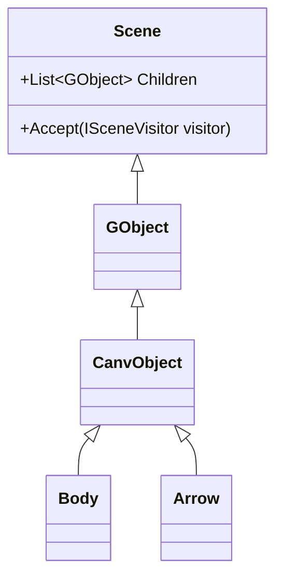

# Canves 架构设计规范

## 1. 分层架构
```
Canves.Core        - 领域模型（GObject/Scene）
Canves.Rendering   - 渲染逻辑（IRenderable接口）
Canves.Utilities   - 数学工具（Vector2优化）
```

## 2. 接口定义
```csharp
// 渲染接口
public interface IRenderable {
    void Render(Graphics g, Vector2 position);
    
    // 默认实现（C# 8.0+）
    public bool IsVisible { get; set; } = true;
}

// 访问者模式接口
public interface ISceneVisitor {
    void Visit(GObject obj);
    void VisitComposite(Scene scene);
}
```

## 3. 模式应用
### 组合模式实现


## 4. 代码规范
1. 所有图形对象必须实现IRenderable
2. Vector2运算必须使用运算符重载
3. 场景修改方法必须进行空值检查

## 5. 待实施改进
- [ ] 创建Canves.Core命名空间
- [ ] 重构Effect.cs中的场景管理逻辑
- [ ] 实现Vector2运算符重载