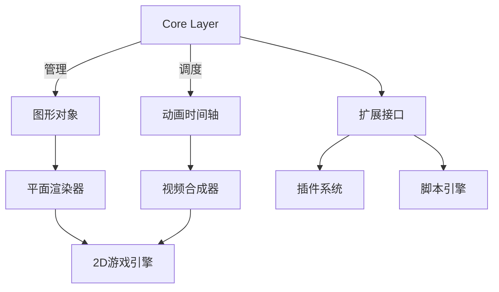
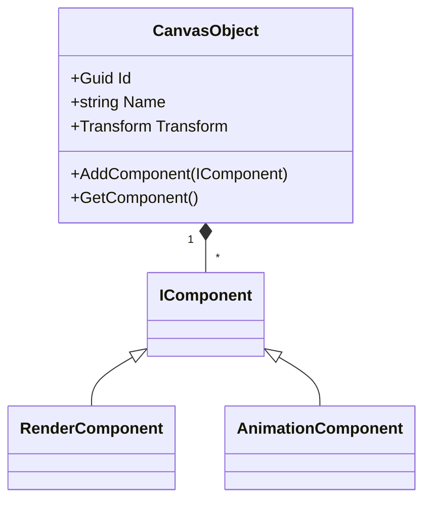

# Canves 图形创作框架


## 功能特性

- **对象管理系统**
  - 图形对象生命周期管理
  - 层级化场景树结构
  - 属性驱动式组件装配
- **动画构建引擎**
  - 时间轴关键帧控制
  - 曲线插值系统
  - 事件驱动动画触发器
- **平面设计工具集**
  - 矢量图形渲染管线
  - 图层混合模式支持
  - 实时预览渲染
- **视频合成模块**
  - 时间线轨道编辑
  - 转场特效系统
  - 多格式导出支持
- **2D游戏框架**
  - 实体组件系统(ECS)
  - 碰撞检测核心
  - 物理模拟接口

## 系统架构



## 安装与构建

```bash
# 恢复NuGet包
dotnet restore

# 调试构建
dotnet build --configuration Debug

# 运行应用程序
.\bin\Debug\net6.0-windows\Canves.exe
```

## 扩展开发

### 插件接口
```csharp
public interface ICanvasExtension {
    string ExtensionName { get; }
    void RegisterComponents(ComponentRegistry registry);
    void ConfigureRenderingPipe(IRenderPipeBuilder builder);
}
```

### 扩展点示例
1. **自定义图形对象**
```csharp
public class CustomShape : CanvasObject {
    public override void Draw(RenderContext context) {
        // 实现自定义绘制逻辑
    }
}
```

2. **动画插值器**
```csharp
public class BounceInterpolator : IInterpolator {
    public double Calculate(double progress) {
        return Math.Abs(Math.Sin(progress * Math.PI * 3)) * (1 - progress);
    }
}
```

## 架构规范

### 对象管理


### 渲染管线
1. 几何处理阶段
2. 材质应用阶段
3. 后期处理阶段
4. 合成输出阶段

## 路线图
- [x] 核心对象模型
- [ ] 动画曲线编辑器
- [ ] 视频导出模块